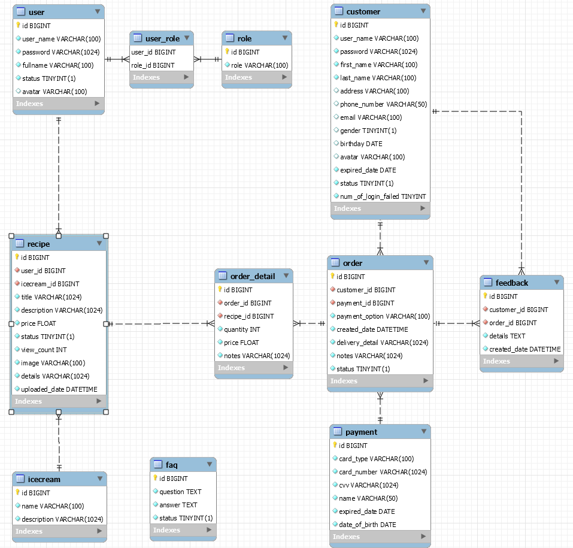
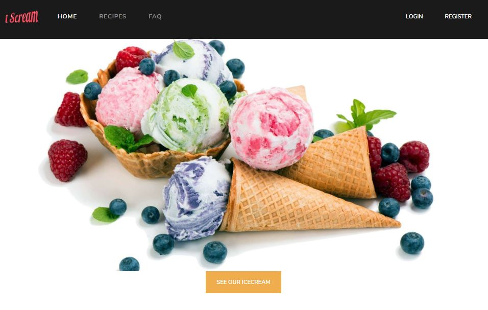
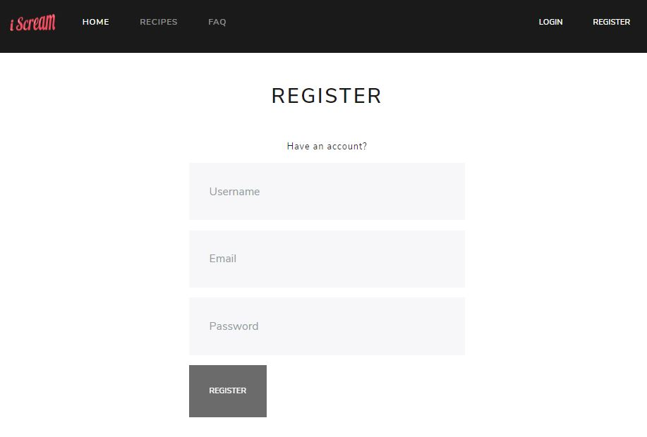
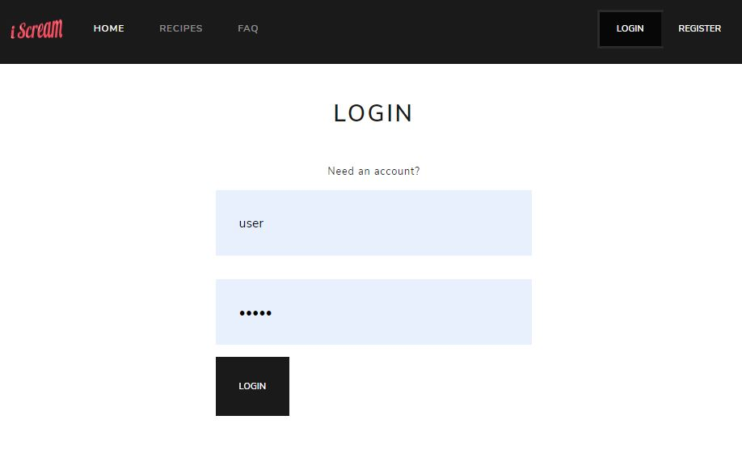

## SpringBoot (Java) Backend + Angular 
An application to depict how to make a RESTful web services with clientside using Angular

### Table of content
[I. Technology stack](#techstack)

[II. Folder Structure](#folderstructure)

[III. Database](#db)

[IV. Features](#features)

[V. How to use this project](#htu)

[VI. Demo](#demo)
- [1. Anonymous pages](#anonymouspage)
- [2. Customer pages](#customerpage)
- [3. User and Admin pages](#anonymouspage)
<a name="techstack"></a>
### Technology Stack
Component         | Technology
---               | ---
Frontend          | [Angular 5](https://github.com/angular/angular)
Bootstrap         | [Bootstrap](https://getbootstrap.com.vn)
Firebase          | Using [Angularfire](https://github.com/angular/angularfire) to store and retrieve images
Backend (REST)    | [SpringBoot](https://projects.spring.io/spring-boot) (Java)
Security          | Token Based (Spring Security and JWT Authentication & Authorization )
REST Documentation| [Swagger UI / Springfox](https://github.com/springfox/springfox) and [ReDoc](https://github.com/Rebilly/ReDoc)
Persistence       | [JPA](https://github.com/spring-projects/spring-data-jpa)
JUnit, Mockito    | Unit-testing with [JUnit](https://github.com/junit-team/junit4) and [Mockito](https://github.com/mockito/mockito)
Client Build Tools| [angular-cli](https://github.com/angular/angular-cli), Webpack, npm
Server Build Tools| Maven(Java)

<a name="folderstructure"></a>
## Folder Structure
```bash
|-- PROJECT FOLDER
    |-- pom.xml # Maven, dependencies
    |-- README.md
    |-- src
    |   |-- main
    |   |   |-- java
    |   |   |   |-- com
    |   |   |       |-- atcud
    |   |   |           |-- icecreamapp
    |   |   |               |-- directoryList.md
    |   |   |               |-- IceCreamAppApplication.java
    |   |   |               |-- [config]        # Contains app's config files
    |   |   |               |-- [controllers]   # Controller layer
    |   |   |               |-- [DTO]           # Contains Data transfer object
    |   |   |               |-- [entities]      # Contains models
    |   |   |               |-- [exceptions]    # Global exception, custom exception
    |   |   |               |-- [repositories]  # Repository layer, contains interfaces
    |   |   |               |   |-- [impl]      # Contains implementations of interfaces
    |   |   |               |-- [security]      # Contains security files such as JwtProvider, Authentication Provider, Filter...
    |   |   |               |-- [services]      # Service layer, contains interfaces
    |   |   |                   |-- [impl]      # Contains implementations of interfaces
    |   |   |-- resources
    |   |       |-- application.properties      # App configuration
    |   |-- test
    |       |-- java
    |       |   |-- com
    |       |       |-- atcud
    |       |           |-- icecreamapp
    |       |               |-- [controllers]   # Unit test for controller layer
    |       |               |-- [services]      # Unit test for service layer
    |       |-- resources
    |           |-- application-test.yml
    |-- frontend                                # Frontend

```

<a name="db"></a>
### Database

<p align="center">
  
</p>

<a name="features"></a>
### Features
* Backend
  * RESTful APIs
  * Token Based Security with multiple authentication providers
  * API documentationwith Swagger 
  * Persisting relational database with Spring JPA, JDBC
  * Pagination using JPA Repository
  * Unit-testing with JUnit and Mockito
 
* Frontend
  * Upload images using Angular Firebase
  * Responsive Website

<a name="htu"></a>
### Build & start Backend
```bash
# Maven Build : Navigate to the root folder where pom.xml is present 
mvn clean install

# Start: (port 8080)
# port and other configurations for API servere is in [./src/main/resources/application.properties](/src/main/resources/application.properties) file

# If you build with maven jar location will be 
java -jar ./target/app-1.0.0.jar

```

<a name="demo"></a>
### Demo
<a name="anonymouspage"></a>
#### 1. Anonymous pages

##### 1.1. Home page


##### 1.2. Login/Register page
  
